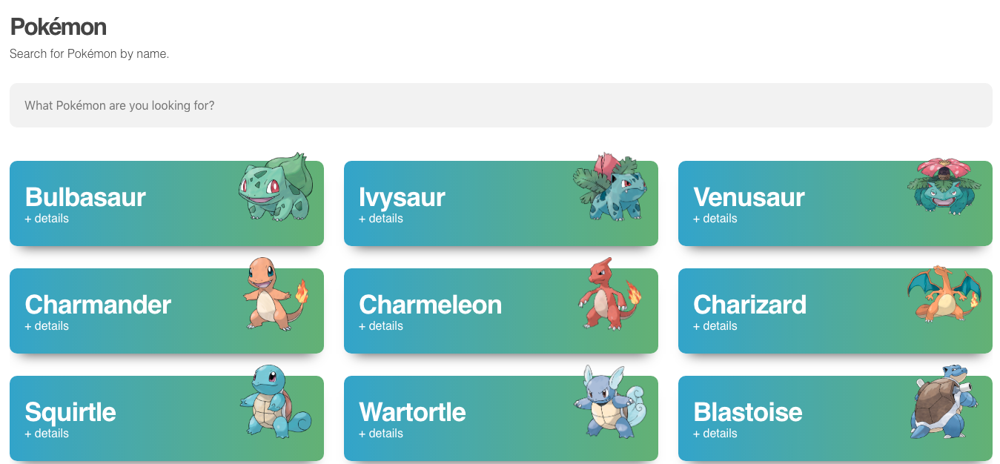

# Challenge Front End | Pokédex



## Desenvolvimento

Este projeto foi desenvolvido com as seguintes tecnologias:

- React Hooks (create-react-app)
- TypeScript
- StyledComponents
- Context
- Layout de apoio [Flávio Farias](https://www.figma.com/file/THLxZSlOoUYMZrjFg0Kl1M/Pok%C3%A9dex?node-id=0%3A1)

## Dependências

- React Debouce Input
- React Router Dom
- React Spinners Kit
- Styled Components

## Instruções para executar o projeto

1. Para executar este projeto, basta cloná-lo com o comando: ``` git clone git@github.com:andycastro/pokemon.git```

2. Entre no diretório com o comando: ``` cd pokemon ```

3. Agora será necessário instalar todas as dependências do projeto. Em seu terminal execute ``` yarn ```
4. Uma vez tendo todas as dependências do projeto instaladas, basta executar o comando ``` yarn start ``` para executar o projeto.


## Branchs deste projeto

- Master -> Produção
- Develop -> Features (desenvolvimento por feature)
- Qa -> Deploy para testes

## Padrões de versionamento
Neste projeto é utilizado Git Flow para padronização do fluxo e Git Semântico para melhor mapeamento/histórico.

## Mobile


## Responsividade


## Contatos
contato@andycastro.com.br